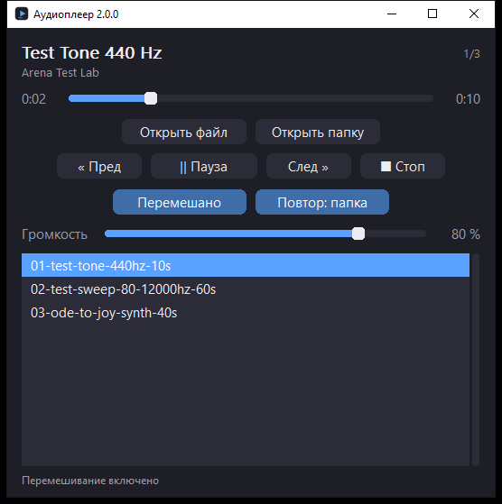
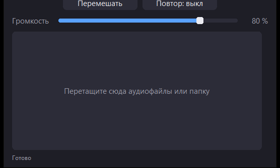

# Простейший аудиоплеер на C++ (Windows)

Тот же плеер, что и `player.py`, переписанный на C++: одно окно, ничего лишнего —
открыл MP3 → играет. **Win32 API** (интерфейс) + **miniaudio** (звук), никаких
внешних библиотек и DLL: один портабельный exe.



```
┌───────────────────────────────────────────────┐
│  Название трека                          2/3   │
│  Исполнитель                                   │
│                                                │
│  1:23   ─────────────●──────────────   3:45    │
│                                                │
│         [ Открыть файл ]  [ Открыть папку ]    │
│   [ « Пред ]  [ || Пауза ]  [ След » ]  [ ■ Стоп ]
│      [ Перемешано ]   [ Повтор: папка ]        │
│                                                │
│  Громкость  ────────────●───────────   80 %    │
│  ┌ плейлист ───────────────────────────────┐  │
│  │ 01 - Test Tone 440 Hz                   │▐ │
│  │ 02 - Test Sweep 80 Hz - 12 kHz          │▐ │
│  │ 03 - Ode to Joy (synth demo)            │▐ │
│  └─────────────────────────────────────────┘  │
│  Играет                                        │
└───────────────────────────────────────────────┘
```

## Возможности

- Открытие файла или папки: папка играет как плейлист — треки по порядку,
  автопереход к следующему, битые молча пропускаются, счётчик «3/17»
- **Перемешивание** (`S` или кнопка): треки играют в случайном порядке
- **Повтор папки** и **повтор трека** (`R` или кнопка циклически: выкл → папка →
  трек). Включённый режим виден по подсвеченной кнопке и в строке состояния
- Естественный порядок файлов: «2» раньше «10»
- Список плейлиста в окне с полосой прокрутки: двойной клик или Enter играет
  выбранный трек, текущий подсвечен и автоматически виден в списке
- Открытие файла через диалог или аргументом командной строки
  (папку тоже можно передать аргументом)
- **Перетаскивание в окно**: файлы и папки, можно бросать сразу несколько
  (папки раскрываются, дубликаты схлопываются, неаудио пропускается со счётчиком
  в строке состояния). В пустом окне вместо списка — подсказка «Перетащите сюда
  аудиофайлы или папку», а курсор Windows сам показывает, что файлы принимаются
- Play / Pause / Stop, Пред / След
- Перемотка мышью по ползунку (клик в любую точку) и стрелками
- Регулировка громкости
- Название трека и исполнитель из тегов (ID3v2, ID3v1 и Vorbis Comment)
- Горячие клавиши
- Тёмная тема, масштабирование под DPI экрана (в т.ч. per-monitor)

**Как ведут себя режимы.** Перемешивание задаёт *порядок* обхода: треки играют
по одному разу в случайном порядке, повтор — что делать, когда обход закончился.
Поэтому «шафл + повтор выкл» проигрывает каждый трек папки один раз и
останавливается, «шафл + повтор папки» начинает новый случайный круг (первый
трек нового круга не повторяет только что сыгранный). Включение перемешивания на
играющем треке не сбивает воспроизведение: текущий трек становится первым в
новом круге. Повтор трека действует только на автопереход — кнопки «Пред» и
«След» работают как обычно.

**Форматы:** MP3 — основной (декодируется самим miniaudio, системные кодеки не
нужны), дополнительно WAV, OGG/Vorbis, FLAC. Формат определяется по содержимому,
а не по расширению: WAV внутри `.mp3` откроется и сыграет.

**Что происходит при перетаскивании.** Папки раскрываются в плейлист (без
подпапок, в естественном порядке), отдельные файлы берутся как есть, дубликаты не
добавляются. Годится файл по расширению или по фактическому содержимому —
переименованный WAV тоже попадёт в список, а `.txt` и прочий мусор отбрасывается
со счётчиком («Перетащено треков: 3, пропущено: 1»). Один перетащенный файл
открывается как «Открыть файл» (плейлист заменяется), несколько — новым
плейлистом. Файл, который декодер не осилит (M4A/AAC/WMA), даёт обычную подсказку
про конвертацию в MP3.

Пустое окно выглядит так — место плейлиста занимает зона приёма:



## Сборка

Нужен компилятор **MinGW-w64** (g++ 9+). Например, готовая сборка
[winlibs.com](https://winlibs.com/) распаковывается в любую папку без установки.

```bat
build.bat
```

Скрипт ищет g++ в `C:\Users\1\Tools\mingw64`; если он у вас в другом месте:

```bat
set MINGW_HOME=C:\mingw64
build.bat
```

Результат:

| Файл | Что это |
|---|---|
| `dist\AudioPlayer.exe` | плеер: статическая сборка, работает без MinGW и без DLL |
| `dist\test_core.exe` | тесты ядра (запускать из корня проекта) |
| `dist\test_tags.exe` | тесты парсера тегов |

`AudioPlayer.exe` не тянет за собой DLL MinGW (libstdc++, libgcc, winpthread
вкомпилированы). Из системных библиотек нужны только те, что есть в Windows 10 и
новее: Universal CRT, user32, gdi32, comdlg32, ole32, shell32. Внутри exe —
значок `app.ico` и версия в свойствах файла.

Двойной клик по `run_player.bat` запускает собранный плеер.

Сборка вручную (если не хочется `.bat`):

```bat
windres -I src -i resources.rc -o build\resources.o
g++ -std=c++17 -O2 -DUNICODE -D_UNICODE -Isrc -Ivendor -c src\player_core.cpp -o build\player_core.o
:: ... остальные .cpp из src\ так же ...
g++ -mwindows -static -o dist\AudioPlayer.exe build\*.o -lole32 -lwinmm -luuid -luser32 -lcomdlg32 -lshell32
```

## Горячие клавиши

| Клавиши | Действие |
|---|---|
| `Space` | Play / Pause |
| `←` / `→` | Перемотка на 5 секунд |
| `↑` / `↓` | Громкость ±5 % |
| `Ctrl+O` | Открыть файл |
| `Ctrl+→` / `Ctrl+←` | Следующий / предыдущий трек |
| Двойной клик / `Enter` по списку | Играть выбранный трек |
| `S` | Перемешивание вкл/выкл |
| `R` | Повтор: выкл → папка → трек |
| `Ctrl+S` | Стоп |
| `Esc` | Закрыть плеер |

## Проверка логики без окна

Ядро плеера (`PlayerCore`) и порядок воспроизведения (`playlist::Queue`) отделены
от интерфейса, звук в тестах уходит в «пустое» устройство вывода — ничего не
слышно и звуковая карта не нужна:

```bat
dist\test_core.exe      :: ядро: play/pause/seek/stop, позиция, конец трека, ошибки
dist\test_playlist.exe  :: шафл, повтор папки и трека, порядок файлов папки
dist\test_tags.exe      :: чтение тегов ID3v2/ID3v1/Vorbis/RIFF INFO
```

`test_core.exe` проверяет состояния play/pause/seek/stop, рост позиции и её
замирание на паузе, зажимы громкости, определение конца трека, чтение тегов,
оценку длительности MP3, WAV внутри `.mp3` и понятные ошибки на мусоре, пустом
файле и M4A внутри `.mp3`. Запускать из корня проекта: тесты берут дорожки из
`test-media\`.

`test_playlist.exe` прогоняет 60 проверок порядка воспроизведения: обычный обход
и «человеческая» сортировка, конец плейлиста, повтор папки и трека, круговорот
кнопок «След»/«Пред», перемешивание (полный круг без повторов, конец круга,
новый круг без повтора того же трека, сохранение текущего трека при включении и
выключении режима), выбор трека в списке и пустой плейлист.

`test_tags.exe` прогоняет 45 проверок парсера тегов и **сверяет результат с
Python-версией**: сам запускает `python` со старым `player.py` и сравнивает
`read_tags` для трёх дорожек из `test-media\` (нужен Python 3 в PATH —
без него сверка просто пропускается).

## Тестовые дорожки

В папке `test-media/` лежат те же три синтезированных MP3, что и в Python-версии
(CBR 192 kbps, теги ID3v2):

| Файл | Длина | Зачем |
|---|---|---|
| `01-test-tone-440hz-10s.mp3` | 0:10 | чистый тон 440 Гц: слышно щелчки, паузы и конец трека |
| `02-test-sweep-80-12000hz-60s.mp3` | 1:00 | лог-свип 80 Гц → 12 кГц: по высоте звука слышно, куда попала перемотка |
| `03-ode-to-joy-synth-40s.mp3` | 0:39 | мелодия с тегами: проверка названия, исполнителя и ползунка позиции |

## Как это устроено

| Файл | Роль |
|---|---|
| `src\player_core.{h,cpp}` | `PlayerCore` — весь звук: загрузка, play/pause/seek/громкость. Про окно не знает |
| `src\media_probe.{h,cpp}` | формат по магическим байтам, точная длительность, запасная оценка длительности MP3 |
| `src\tags.{h,cpp}` | чтение тегов без библиотек: ID3v2.2/2.3/2.4, ID3v1, Vorbis Comment (FLAC/OGG), RIFF INFO (WAV) |
| `src\playlist.{h,cpp}` | отбор аудиофайлов папки, «человеческая» сортировка и `playlist::Queue` — порядок воспроизведения (шафл, повтор) |
| `src\app_win32.{h,cpp}` | окно: кнопки, список, ползунки, горячие клавиши, плейлист, приём перетаскивания |
| `src\ui_slider.{h,cpp}` | ползунок в тёмной теме (позиция, громкость, полоса прокрутки) |
| `src\ui_theme.h` | цвета и шрифты |
| `src\miniaudio_impl.cpp` | единственное место, где компилируется реализация miniaudio |
| `src\main.cpp` | точка входа: DPI, COM, аргументы командной строки |
| `vendor\miniaudio.h` | miniaudio 0.11.25 (public domain / MIT-0), один заголовочный файл |

**Порядок воспроизведения.** Им заведует `playlist::Queue` — отдельный модуль без
знания о звуке и окне, поэтому его логика покрыта тестами (`dist\test_playlist.exe`).
Внутри два представления: список папки для отображения и `order_` — порядок
обхода (обычный или перемешанный) плюс позиция в нём. Кнопки «След»/«Пред» ходят
по кругу всегда, а автопереход спрашивает режим: повтор трека остаётся на месте,
повтор папки замыкает круг (в шафле — новый случайный круг), без повтора после
последнего трека играть больше нечего.

**Перетаскивание.** `DragAcceptFiles()` включает у окна флаг `WS_EX_ACCEPTFILES` —
Windows сама показывает курсор «копировать» и присылает `WM_DROPFILES`. Никакого
COM и `IDropTarget` не нужно: Проводник работает через это сообщение, а пути
читаются `DragQueryFileW`. Список плейлиста в пустом состоянии скрывается, и его
место занимает подсказка-зона приёма.

**Позиция трека.** Считаем сами (`_anchor_pos` + монотонное время), как и в
Python-версии: у потокового звука внутренний курсор декодера читает файл вперёд,
поэтому он опережает то, что слышно. Конец трека определяет сам движок
(`ma_sound_at_end`), а `poll()` из таймера интерфейса превращает это в переход
к следующему треку.

**Без мигания.** Окно создаётся с `WS_CLIPCHILDREN` (иначе его перерисовка
затирает кнопки и список), свою часть рисует в памяти и только потом выводит на
экран, а таймер обновляет не всё окно, а лишь те надписи, которые изменились
(время, счётчик, статус). В неподвижном интерфейсе не меняется ни один пиксель —
проверено покадровой съёмкой области окна: на паузе 0 изменившихся пикселей во
всех зонах, при воспроизведении двигаются только часы и ползунок позиции.

**Длительность.** Для WAV/FLAC/MP3 её отдаёт декодер miniaudio. Для OGG/Vorbis
stb_vorbis длину не сообщает вовсе, поэтому считаем её по granule-позиции
последней страницы Ogg. Если и это не вышло (например, битый MP3) — грубая
оценка «размер файла × 8 / битрейт первого кадра», и ползунок позиции
отключается.

**Снюхивание формата.** Если декодер не смог открыть файл, читаем магические
байты (`media::sniff_format`): для M4A/AAC/WMA показываем понятную подсказку про
конвертацию в MP3, для «мусора» — «это не аудиофайл или он повреждён». Если
содержимое не совпадает с расширением (WAV внутри `.mp3`), miniaudio
разбирается сам — в отличие от SDL_mixer ему не нужен файловый объект.

## Чем отличается от Python-версии

| | Python (`player.py` 1.3.0) | C++ (эта версия 2.0.0) |
|---|---|---|
| Интерфейс | tkinter | Win32 API, тёмная тема |
| Звук | pygame / SDL_mixer | miniaudio (WASAPI/DirectSound/WinMM) |
| Теги | mutagen | свой парсер (`src\tags.cpp`) |
| Размер поставки | Python + ~20 МБ exe | один exe ~1.8 МБ, без зависимостей |
| Кроссплатформенность | Windows/macOS/Linux | Windows (ядро и miniaudio — переносимы) |

Перенесено 1:1: раскладка окна, тексты, горячие клавиши, логика плейлиста и
автоперехода, пропуск битых файлов, поведение ползунков, счётчик «3/17»,
возврат к текущему треку кнопкой «Пред» после 3 секунд.

Добавлено к Python-версии: перемешивание, повтор папки и повтор трека, а также
перетаскивание файлов и папок в окно — в `player.py` их не было (он умел только
«по порядку до конца», а перетаскивание значилось в списке «что можно добавить»).

Не перенесено: `convert_m4a_in_mp3.py` (конвертер библиотеки — он остаётся в
Python-проекте).

## Если что-то не так

| Симптом | Что делать |
|---|---|
| `[error] g++ not found` | Укажите `set MINGW_HOME=...` и запустите `build.bat` снова |
| Нет звука, ошибок тоже нет | Проверьте устройство вывода и громкость в микшере (`Win+R` → `sndvol`) |
| «Нет доступа к звуковому устройству» | Нет звукового устройства/драйвера (часто — в удалённой сессии или VM) |
| `--:--` вместо длительности | Формат без метаданных о длине и без пригодной оценки (например, обрезанный OGG) |
| Ошибка при открытии отдельных `.mp3` | Файл внутри — M4A/AAC/WMA либо битый: плеер напишет, что именно, и предложит конвертацию в MP3 |
| Перемотка MP3 уходит на пару секунд не туда | Особенность MP3: кадр без точной метки времени |
| Русский путь к файлу | Поддерживается: строки внутри UTF-8, Win32 API вызывается в UTF-16 |
| «Шафл + повтор выкл» остановился после всех треков | Так и задумано: перемешивание меняет порядок, повтор — что делать в конце круга |
| Режимы не запоминаются между запусками | Плеер, как и Python-версия, не хранит настроек: ничего не пишет на диск |
| Перетаскивание ничего не делает | Windows запрещает бросать файлы в окно, если Проводник запущен с правами администратора, а плеер — нет (и наоборот). Запустите оба от одного пользователя |
| Перетащил `.txt` — «Это не аудиофайл» | Так и задумано: в плейлист попадает только аудио (по расширению или по содержимому) |

## Что можно добавить дальше

- Запоминание режимов и позиции между запусками (например, в `%APPDATA%`)
- Подсветку зоны приёма при перетаскивании (`IDropTarget` вместо `WM_DROPFILES`)
- Эквалайзер и fade-in/fade-out (`ma_sound_set_fade_in_milliseconds`)
- Плейлист из нескольких папок и M3U

## Лицензия

Исходный код плеера — GNU General Public License v3.0, полный текст в файле
[`LICENSE`](LICENSE).

`vendor/miniaudio.h` — miniaudio 0.11.25, public domain / MIT-0 (лицензия
самой библиотеки, на код плеера не влияет).

Дорожки в `test-media/` синтезированы автором специально для тестов.

## Готовые сборки

В папке `dist/` лежат уже собранные бинарники, чтобы можно было запустить
плеер и тесты без установки MinGW-w64:

| Файл | Назначение |
|---|---|
| `dist\AudioPlayer.exe` | сам плеер (статическая сборка, DLL не нужны) |
| `dist\test_core.exe` | тесты ядра |
| `dist\test_playlist.exe` | тесты логики плейлиста (60 проверок) |
| `dist\test_tags.exe` | тесты парсера тегов (45 проверок) |

Тесты запускать из корня проекта — они берут дорожки из `test-media\`.
